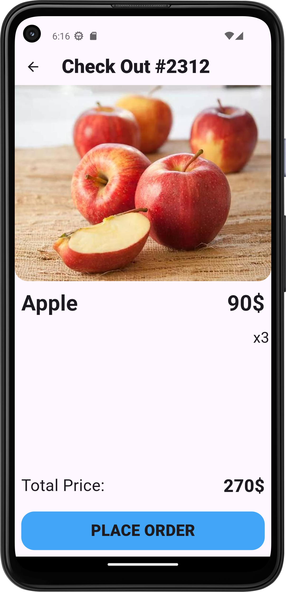

# Fruit Shop App
This app is basically a fruit shop app where user can buy fruits..Basically i made that api with js..then with the help of http i fetch the info and then i also make the cards dissimbled which is way cool! Lets see where it goes...i forgot to mention i have used Getx for state managements.
## App Screenshots!

